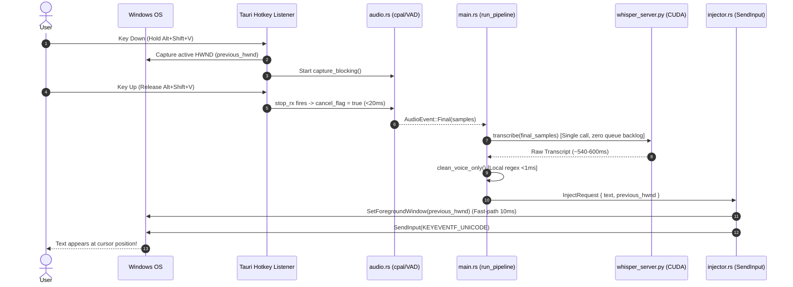

## Architecture: Local-First Contextual Voice Transcriptor

### Design Decisions

- **Tauri 2.0 over Electron**: Tauri uses a native OS webview and a Rust core — no bundled Chromium. Binary size drops from ~150MB to ~5MB. System-level APIs (hotkeys, accessibility, audio) are written in Rust where latency matters most.
- **Python sidecar for Whisper**: `faster-whisper` runs faster in Python/CTranslate2 than `whisper.cpp` on CPU. Tauri spawns it as a child process and communicates via a local Unix/TCP socket. This keeps the Rust core free of heavy Python GIL dependencies.
- **Hardware Acceleration**: GPU acceleration via CUDA 12 and cuDNN 9 using `base.en` with FP16 compute type.
- **Native Win32 SendInput**: Batched `KEYEVENTF_UNICODE` input simulation with zero scancode bugs, active modifier key untangling, and instant HWND focus restoration.
- **Event-driven pipeline**: All stages (capture → transcribe → clean → inject) communicate through Rust `tokio` async channels. No stage blocks another.
- **SvelteKit for UI**: Minimal bundle, reactive state without a virtual DOM, ideal for a tray-based status indicator.

---

### Key Interfaces

```rust
// Rust: pipeline message types
enum PipelineEvent {
    RecordingStarted,
    AudioCaptured(Vec<f32>),       // raw PCM samples
    TranscriptReady(String),       // raw Whisper output
    CleanedTextReady(String),      // LLM-cleaned output
    InjectionComplete,
    Error(PipelineError),
}

// Rust: context profile
struct ContextProfile {
    name: String,                  // "Gmail", "Slack", "VS Code"
    window_title_patterns: Vec<String>,
    system_prompt: String,
    vocabulary_hints: Vec<String>, // injected into Whisper context
}
```

---

### Data Flow


